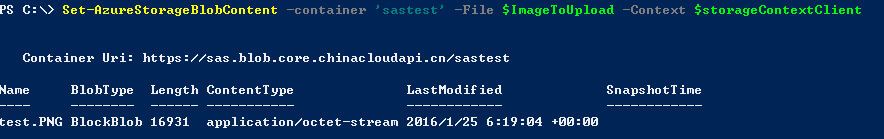
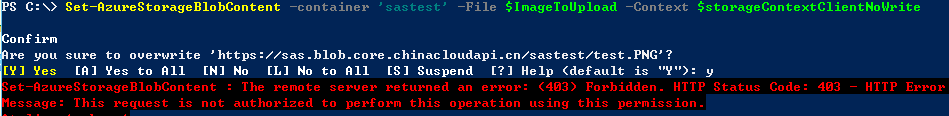

#如何为Azure存储的blob创建SAS token

存储账号名称和存储账号密钥是操作存储账号的重要的信息，一旦存储账号外泄，存储账号内的资源将会完全暴露。SAS可以帮助我们避免存储账户密钥的泄露，请阅读[这篇文章](http://www.windowsazure.cn/documentation/articles/storage-dotnet-shared-access-signature-part-1/)了解SAS的详细的概念，文章中也包含了token中各个参数的含义。

这篇文章将帮助我们创建SAS的token

- .Net的方式创建SAS token
- PowerShell的方式创建SAS token
- Rest的方式创建SAS token

##.Net的方式创建SAS token

关于.Net的方式创建SAS token请阅读下面的文章：

[创建SAS并将SAS用于Blob服务](http://www.windowsazure.cn/zh-cn/documentation/articles/storage-dotnet-shared-access-signature-part-2/)

##PowerShell的方式创建SAS token

>使用Powershell前有关Azure PowerShell的安装、配置和连接到订阅请阅读[这篇文章](http://www.windowsazure.cn/documentation/articles/powershell-install-configure)

**如何创建SAS token**

	#定义一些参数
	$storageAccountName = <storage account name>
	$storageAccountKey = <storage account key>
	$containerName = 'sastest'

	#PowerShell的方式创建storage操作的上下文
	$storageContext = New-AzureStorageContext -StorageAccountName $storageAccountName -StorageAccountKey $storageAccountKey
	
	#创建一个新的容器
	$container = New-AzureStorageContainer -Context $storageContext -Name $containerName
	$cbc = $container.CloudBlobContainer
	
	#创建临时SAS (临时SAS和带有存储访问策略的SAS请阅读下面的参考文档)
	$sasToken = New-AzureStorageContainerSASToken -container $containerName -permission rwl -Context $storageContext
	write-host $sasToken

	$sasTokenNoWrite = New-AzureStorageContainerSASToken -container $containerName -permission rl -Context $storageContext
	#临时的SAS token创建成功，下面是使用举例：

参考文档： [临时SAS和带有存储访问策略的SAS](http://www.windowsazure.cn/documentation/articles/storage-dotnet-shared-access-signature-part-1/)

PowerShell指令：[New-AzureStorageContainerSASToken](https://msdn.microsoft.com/en-us/library/azure/dn584416.aspx)		

**如何在已知SAS Token的情况下来使用**

	#在知道SAS token的client端创建存储上下文
	$storageContextClient = New-AzureStorageContext -StorageAccountName $storageAccountName -SASToken $sasToken
	#这个存储上下文只可以在容器下做相应的操作并且只能执行在创建过程中服务的权限
	#如果你要继续创建container将会报错
	New-AzureStorageContainer -Context $storageContextClient -Name 'test1'
	#错误内容: New-AzureStorageContainer : The remote server returned an error: (403) Forbidden.
	#测试上传文件
	$ImageToUpload = "D:\test.PNG"
	Set-AzureStorageBlobContent -container 'sastest' -File $ImageToUpload -Context $storageContextClient
	
	#使用带存储策略的SAS Token
	$storageContextClientWithPolicy = New-AzureStorageContext -StorageAccountName $storageAccountName -SASToken $sas
	Set-AzureStorageBlobContent -container 'sastestwithpolicy' -File $ImageToUpload -Context $storageContextClientWithPolicy
	
结果：

**注意**:在创建临时SAS中我们赋予了read、write和list权限，如果没有write权限上述上传将会报错具体如下所示

	$storageContextClientNoWrite = New-AzureStorageContext -StorageAccountName $storageAccountName -SASToken $sasTokenNoWrite
	Set-AzureStorageBlobContent -container 'sastest' -File $ImageToUpload -Context $storageContextClientNoWrite

**创建带有存储访问策略的SAS Token**

	#定义一些参数
	$storageAccountName = <storage account name>
	$storageAccountKey = <storage account key>
	$containerNameWithPolicy = 'sastestwithpolicy'

	#PowerShell的方式创建storage操作的上下文
	$storageContext = New-AzureStorageContext -StorageAccountName $storageAccountName -StorageAccountKey $storageAccountKey
	
	#创建一个新的容器
	$container = New-AzureStorageContainer -Context $storageContext -Name $containerNameWithPolicy
	$cbc = $container.CloudBlobContainer
	#为新创建的容器设置存储访问策略
	$permissions = $cbc.GetPermissions();
	$policyName = 'policy1'
	$policy = new-object 'Microsoft.WindowsAzure.Storage.Blob.SharedAccessBlobPolicy'
	$policy.SharedAccessStartTime = $(Get-Date).ToUniversalTime().AddMinutes(-5)
	$policy.SharedAccessExpiryTime = $(Get-Date).ToUniversalTime().AddHours(10)
	$policy.Permissions = "Read,Write,List,Delete"
	$permissions.SharedAccessPolicies.Add($policyName, $policy)
	$cbc.SetPermissions($permissions);
	
	#获取SAS token
	$sas = $cbc.GetSharedAccessSignature($policy, $policyName)
	Write-Host 'Shared Access Signature= '$($sas.Substring(1))''
	

https://msdn.microsoft.com/en-us/library/dn466430.aspx

##Rest的方式创建SAS token

 		public static string GenerateSAS()
        {
            string sas = "";
            DateTime start = DateTime.UtcNow;
            DateTime end = DateTime.UtcNow.AddDays(1);
            string accountName = "willshao";
            string accountKey = "<account key>";
            string signedpermissions = "r";
            string signedstart = DateTime.UtcNow.ToString("O");
            string signedexpiry = DateTime.UtcNow.AddDays(1).ToString("O");
            string canonicalizedresource = "blob/"+accountName+"/test/Capture.PNG";
            string signedidentifier = "";
            string signedversion = "2015-04-05";
            string rscc = "";
            string rscd = "file; attachment";
            string rsce = "";
            string rscl = "";
            string rsct = "binary";

            string StringToSign = signedpermissions + "\n" +
               signedstart + "\n" +
               signedexpiry + "\n" +
               canonicalizedresource + "\n" +
               signedidentifier + "\n" +
               "" + "\n" +
               "" + "\n" +
               signedversion + "\n" +
               rscc + "\n" +
               rscd + "\n" +
               rsce + "\n" +
               rscl + "\n" +
               rsct;
            byte[] SignatureBytes = System.Text.Encoding.UTF8.GetBytes(StringToSign);
            System.Security.Cryptography.HMACSHA256 SHA256 = new System.Security.Cryptography.HMACSHA256(Convert.FromBase64String(accountKey));
            string sig = Convert.ToBase64String(SHA256.ComputeHash(SignatureBytes));

            string sasURL = string.Format("http://{0}.blob.core.windows.net/test/Capture.PNG?sv={1}&sr={2}&sig={3}&st={4}&se={5}&sp={6}&rscd={7}&rsct={8}",
                 HttpUtility.UrlEncode(accountName),
                HttpUtility.UrlEncode(signedversion),
                HttpUtility.UrlEncode("b"),
                HttpUtility.UrlEncode(sig),
                HttpUtility.UrlEncode(signedstart),
                HttpUtility.UrlEncode(signedexpiry),
                HttpUtility.UrlEncode(signedpermissions),
                  HttpUtility.UrlEncode(rscd),
                HttpUtility.UrlEncode(rsct)
                );
            return sas;
        }

